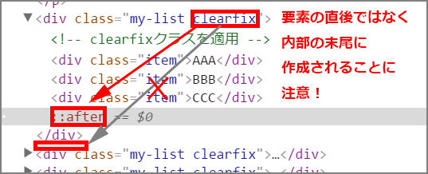

# クリアフィックス

フロートの解除について、順を追って解説します。

### clearしない場合
`float`を使った後で`clear`しないと、その後の要素の配置が狂ってしまいます。

- <a href="http://sutara79.github.io/demo-clearfix/index.html" target="_blank">デモ: index.html</a>

### 次の要素にclearを指定する場合
`float`を使う要素が親要素に包まれていて、その次の要素に`clear`を指定する場合。  
CSSに追記するだけなので楽です。  
これで問題ない場合もありますが、記述したスタイル指定が正しく反映されない場合も多いです。

- <a href="http://sutara79.github.io/demo-clearfix/02.html" target="_blank">デモ: 02.html</a>

### 直後に空要素を設ける場合
CSSのみ追記、という横着をせず、`float`を使った直後の要素に`clear`を指定します。  
下記のデモではその「直後の要素」が存在しないので、わざわざ空要素を作成しています。

- <a href="http://sutara79.github.io/demo-clearfix/03.html" target="_blank">デモ: 03.html</a>

### クリアフィックスを使う場合
HTML文中に空要素を記述せず、`:after`というCSSの擬似要素を用いて空要素を作成します。

- <a href="http://sutara79.github.io/demo-clearfix/04.html" target="_blank">デモ: 04.html</a>

`clearfix`クラスを適用した要素の直後**ではなく**、適用した要素の**内部の末尾**に新たに要素が追加されることに注意してください。

#### 擬似要素`:after`について
- 簡単な説明: http://www.htmq.com/selector/after.shtml
- 詳しい説明: https://developer.mozilla.org/ja/docs/Web/CSS/::after
