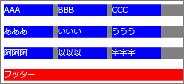
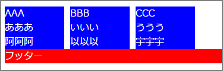
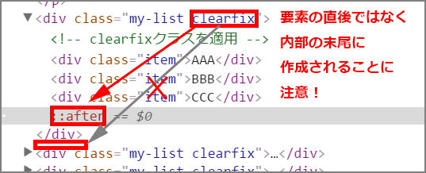

# フロートの解除にはクリアフィックスが便利

フロートの解除について、順を追って解説します。

下記のような表示を目指してHTMLとCSSを記述します。



##### HTML
```html
<div class="container">
  <div class="item">AAA</div>
  <div class="item">BBB</div>
  <div class="item">CCC</div>
</div>
<div class="container">
  <div class="item">あああ</div>
  <div class="item">いいい</div>
  <div class="item">ううう</div>
</div>
<div class="container">
  <div class="item">阿阿阿</div>
  <div class="item">以以以</div>
  <div class="item">宇宇宇</div>
</div>
<div class="footer">
  フッター
</div>
```

##### CSS
```css
.container {
  margin: 20px 0;
}
.item {
  float: left;
  margin-right: 10px;
  width: 100px;
}
```

- - -
### clearしないとどうなるか


- [デモ: 01.html](http://sutara79.github.io/demo-clearfix/01.html)

`float`を使った後で`clear`しないと、表示が大きく乱れてしまいます。


- - -
### フロートの親要素の次の要素でクリアすると


- [デモ: 02.html](http://sutara79.github.io/demo-clearfix/02.html)

`float`を包む親要素の次の要素に`clear`を指定します。  
これで問題ない場合もありますが、記述したスタイル指定が正しく反映されない場合も多いです。

```css
.container {
  clear: left;
}
.footer {
  clear: left;
}
```

- - -
### フロートの直後に空要素を設置すれば解決


- [デモ: 03.html](http://sutara79.github.io/demo-clearfix/03.html)

`float`を指定する要素の直後に、空要素を設置して`clear`を指定します。

```html
<div class="container">
  <div class="item">AAA</div>
  <div class="item">BBB</div>
  <div class="item">CCC</div>
  <div class="clear-element"></div><!-- 空要素 -->
</div>
```

```css
.clear-element {
  clear: both;
}
```

- - -
### クリアフィックスを使えばキレイ


- [デモ: 04.html](http://sutara79.github.io/demo-clearfix/04.html)

HTML文中に空要素を記述せず、`:after`というCSSの擬似要素を用いて空要素を作成します。  
これならば、デザインのためだけ不要なHTMLタグを記述しなくてすみます。  
なお、対応ブラウザは**IE8以上**です。  
IE6,7向けの記述は下記を参考にしてください。

- [clearfixの最新版 -フロート関連やマージン相殺の不具合を解決するモダンブラウザ用clearfix | コリス](http://coliss.com/articles/build-websites/operation/css/css-latest-clearfix.html)

```html
<div class="container clearfix"><!-- clearfixクラスを適用 -->
  <div class="item">AAA</div>
  <div class="item">BBB</div>
  <div class="item">CCC</div>
</div>
```

```css
.clearfix:after {
  clear: both;
  content: '';
  display: block;
}
```

#### 擬似要素`:after`について
`:after`で作成される要素は、直後ではなく**内部の末尾**に設置されることに注意してください。




- 簡単な説明: http://www.htmq.com/selector/after.shtml
- 詳しい説明: https://developer.mozilla.org/ja/docs/Web/CSS/::after
